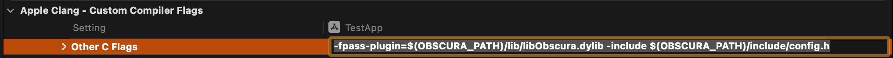
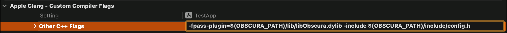
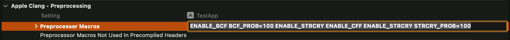
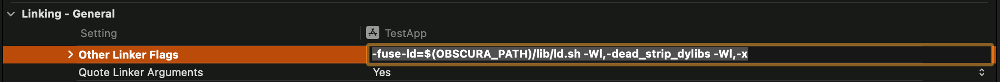
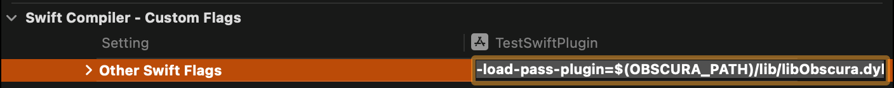

# Obscura

[](https://polyformproject.org/licenses/noncommercial/1.0.0) [](../../releases/latest)

A hussle-free LLVM-based obfuscator. It ships 13 passes (*now an industry-dominating anti-hook!*) covering ObjC metadata protection, runtime integrity verification, and general code obfuscation. Everything is controlled through a small set of compiler flags. Source code changes are not required.

Obscura works with any LLVM-based compiler that supports pass plugins (Clang, AppleClang, and the Swift thing). Thus, obfuscation is effectively achieved for C(++), ObjC(++), and Swift (currently only briefly tested) runtimes. May add more explicit rustc (Rust) support in the future if any demand arises. See [Installation](#installation) for quick setup, and read [Compatibility](#compatibility) carefully to understand installation requirements.

## How it works

LLVM's new PM lets you inject custom compiler passes (at the IR phase) into the optimization pipeline LEGALLY, without any modifications to the compiler itself. Eventually, you don't need to build LLVM anymore, and older projects like Hanabi that based on earlier versions of LLVM now render completely irrelevant, though they used to provide a great extent of convenience a while ago.

Obscura registers its passes at the `OptimizerLastEP` callback, which fires after all standard optimizations — at any optimization level, including `-O0`. However, optimization levels other than `-O1` aren't tested so well. `-O1` is therefore recommended.

You include `config.h` in your source and pass `-D` flags to the compiler. These flags create marker globals in the IR that survive optimization. The plugin reads them and decides what to do. If no config header is included (no config marker found), a preferred set of obfuscation passes runs, for the sake of quick setup and convenience.

The plugin runs in four phases:

1. **Code insertion** - Anti-ClassDump metadata protection, constant encryption, string encryption, anti-debug checks, and dynamic symbol resolution. These passes add new code to the module.
2. **Code obfuscation** - Block splitting, bogus control flow, control flow flattening, and instruction substitution. These passes obfuscate everything from phase 1 (and the original code), so decryption routines are never left in the clear.
3. **Structural obfuscation** - Indirect branching and function wrapping. These break the call graph and control flow at the module level.
4. **Cleanup** — Marker globals are removed. Nothing plugin-related survives in the final binary.

## Passes

In general, the following passes are available:

| Pass | Flag | What it does | Platform |
|------|------|--------------|----------|
| [Anti-ClassDump](docs/ACD.md) | `ENABLE_ACD` | Hides ObjC class metadata from class-dump (and other static analyzers actually) | ObjC Darwin |
| [Anti-Debug](docs/ADB.md) | `ENABLE_ADB` | Inserts ptrace-based debugger detection | AArch64 Darwin |
| [Constant Encryption](docs/CONSTENC.md) | `CONSTENC_LITE`, `CONSTENC_DEEP`, `CONSTENC_FULL` | Encrypts global constants, decrypts at runtime. Use with L2G to get more constants encrypted | All |
| [Function Call Obfuscate](docs/FCO.md) | `ENABLE_FCO` | Replaces external calls with dlopen/dlsym lookups, and allows imports substitution with your own wrappers | Darwin |
| [String Encryption](docs/STRCRY.md) | `ENABLE_STRCRY` | Encrypts string literals with per-string inline decrypt loops | All |
| [Anti-Hook](docs/AH.md) | `ENABLE_AH`, `ENABLE_AH_INLINE`, `ENABLE_AH_REBIND` | Protects against inline hooking (and patching) and symbol rebinding | Darwin, AArch64 |
| [Basic Block Splitting](docs/SPLIT.md) | `ENABLE_SPLIT` | Splits blocks to create more targets for other passes | All |
| [Bogus Control Flow](docs/BCF.md) | `ENABLE_BCF` | Inserts cloned blocks behind opaque predicates | All |
| [Control Flow Flattening](docs/CFF.md) | `ENABLE_CFF` | Replaces branches with switch-based dispatch | All |
| [Instruction Substitution](docs/SUB.md) | `ENABLE_SUB` | Replaces arithmetic with equivalent but more complex expressions | All |
| [Indirect Branch](docs/INDIBRAN.md) | `ENABLE_INDIBRAN` | Converts branches to table-based indirect jumps | All |
| [Function Wrapper](docs/FUNCWRA.md) | `ENABLE_FUNCWRA` | Wraps call sites through intermediate functions | All |
| [Local-to-Global](docs/L2G.md) | `L2G_ENABLE` | Promotes local constants to globals (for encryption, has little use separately) | All |

Most passes accept probability and iteration parameters. See the individual docs or `config.h` comments for the full flag list and other useful details.

All passes are off **IF** `config.h` is included. Enable them with `-D` flags. It's recommended to do so in global scope (not per-TU), through a build system flag or a direct compiler flag. If config.h is **not** included, the plugin applies built-in defaults automatically (most optimal configuration as I see it):

| Pass | Settings |
|------|----------|
| ACD | prob=100 |
| ADB | prob=20 |
| CONSTENC | lite, prob=20 |
| FCO | prob=100, hide_fw |
| STRCRY | prob=100 |
| AH | full (inline + rebind), prob=100 |
| SPLIT | num=1 |
| BCF | prob=20, loop=1, cond_compl=1, junkasm, minnum=1, maxnum=3 |
| CFF | prob=20 |
| SUB | prob=20, loop=1 |
| INDIBRAN | prob=100 |
| L2G | prob=20, dedup |
| PRNG | seed=42 |

### Per-function annotations

You can override global settings on a per-function basis without changing `-D` flags. These are (almost) as they were in Hikari, and more annotations will be supported in the future:

```c
// enable BCF and SUB for this function only
OBSCURA_ANNOTATE("bcf bcf_prob=100 sub sub_prob=100")
int critical_function(int x) { ... }

// disable BCF for this function even if globally enabled
OBSCURA_ANNOTATE("nobcf")
int performance_sensitive(int x) { ... }

// per-function parameter tuning
OBSCURA_ANNOTATE("bcf bcf_loop=3 bcf_cond_compl=5 indibran indibran_enc_jump")
int heavily_protected(int x) { ... }
```

Module-wide macros and ObjC-specific annotations will be added soon.

## Compatibility

Obscura is built against a specific LLVM version. You **must** download a release with the LLVM version falling within the Xcode version matrix shown below. For instance, LLVM 19.1.4 and 19.1.5 have different ABIs, and AppleClang would simply crash at a point if there's a version mismatch.

For Linux builds, the LLVM version **must match** your host clang's LLVM version (the one it's running on, and keep in mind that `clang -v` only gives you the clang version, NOT the LLVM version), and that's up to you to find out your clang's LLVM version.

| LLVM | Status | Xcode |
|------|--------|-------|
| 19.1.5 | Stable | 26.0+ |
| 19.1.4 | Untested | 16.3 — 16.4 |
| 17.0.6 | Stable | 16.0 — 16.2 |
| 16.0.0 | Untested | 15.0 — 15.4 |
| 16.0.0 | Untested | 15.0 — 15.4 |
| 13.0.0 | Generally Stable | 13.3–14.2 |

To get to know your LLVM version, just open Xcode and note the version. Then, download the matching release. For a complete Xcode-to-LLVM version mapping (I doubt you'll need it), see [Wikipedia: Xcode Version History](https://en.wikipedia.org/wiki/Xcode#Xcode_15.0_-_16.x_(since_visionOS_support)).

**Languages:** C(++), Objective-C(++). The latest versions of [Swift](https://github.com/swiftlang/swift) are also supported, but this requires Xcode 26+, as per my knowledge, and a special flag (see below). You may compile the newest runtime by yourself if you wish to have Swift obfuscation supported on earlier versions of Xcode. Regarding Rust support, it's completely uncertain for now, but it's at least known that it runs on LLVM, so might as well be supported by Obscura.

## Installation

Download the release for your LLVM version from [Releases](../../releases) and extract it. You'll get:

```
lib/libObscura.dylib    — the plugin
lib/libDeps.dylib       — LLVM symbol fallback (macOS only)
lib/ld.sh               - ld script (required for AH)
include/config.h        — configuration header
```

On MacOS (Darwin), it's **essential** that both dylibs exist and rest in the same directory, since AppleClang doesn't export all LLVM symbols (good job to Apple!). Otherwise, you'll get crashes at seemingly random points (SIGSEGV at 0x0 from unresolved lazy stubs). This isn't the case for Linux.

## Usage

**Important:** `-Wl,-x` is recommended for all builds. Obscura already uses `PrivateLinkage` and `HiddenVisibility` to eliminate most generated symbols, but `-x` catches anything else the linker might keep around (local symbols, debug nlist symtab entries). It's cheap and there's no reason not to. Additionally, `-Wl,-dead_strip_dylibs` is required for FCO to function properly (described in [FCO](docs/FCO.md)). Lastly, `-fuse-ld=lib/ld.sh` is required for [AH](docs/AH.md) inline mode (just set it and forget).

### Minimal

```bash
clang -fpass-plugin=lib/libObscura.dylib -fuse-ld=lib/ld.sh -Wl,-dead_strip_dylibs -Wl,-x -O1 file.c -o out
```

### Controlled

```bash
clang -fpass-plugin=lib/libObscura.dylib \
    -Iinclude -include config.h \
    -DENABLE_BCF -DBCF_PROB=100 \
    -DENABLE_STRCRY \
    -DENABLE_CFF -DCFF_PROB=50 \
    -Wl,-dead_strip_dylibs -Wl,-x \
    -O1 file.c -o out
```

### Make

```makefile
OBSCURA := /path/to/obscura

CFLAGS += -fpass-plugin=$(OBSCURA)/lib/libObscura.dylib \
          -I$(OBSCURA)/include -include $(OBSCURA)/include/config.h \
          -DENABLE_AH -DAH_CALLBACK=\"on_tamper\" \
          -DENABLE_INDIBRAN -DENABLE_SUB -DSUB_PROB=80 \
          -DFCO_MAP=\"dlsym=my_dlsym\;open=my_open\"
LDFLAGS += -fuse-ld=$(OBSCURA)/lib/ld.sh -Wl,-dead_strip_dylibs -Wl,-x
```

### CMake

```cmake
set(OBSCURA "${CMAKE_SOURCE_DIR}/obscura")

add_compile_options(
    -fpass-plugin=${OBSCURA}/lib/libObscura.dylib
    -I${OBSCURA}/include -include ${OBSCURA}/include/config.h
    -DENABLE_AH -DAH_CALLBACK="on_tamper"
    -DENABLE_BCF -DBCF_PROB=100
    -DENABLE_STRCRY
    -DENABLE_CFF
    -DFCO_MAP="dlsym=my_dlsym;open=my_open"
)
add_link_options(-fuse-ld=${OBSCURA}/lib/ld.sh -Wl,-dead_strip_dylibs -Wl,-x)
```

### Xcode

For convenience, define a user-defined build setting `OBSCURA_PATH` pointing to the Obscura directory (e.g. `$(SRCROOT)/obscura`). Reference it with `$(OBSCURA_PATH)` in the settings below (Build Settings).

#### Other C Flags (`OTHER_CFLAGS`)

Applies to `.c` and `.m` files only.

```
-fpass-plugin=$(OBSCURA_PATH)/lib/libObscura.dylib
-include $(OBSCURA_PATH)/include/config.h
```



#### Other C++ Flags (`OTHER_CPLUSPLUSFLAGS`)

Applies to `.cpp` and `.mm` files only. This setting usually inherits from `OTHER_CFLAGS`, but you should verify anyway.

```
-fpass-plugin=$(OBSCURA_PATH)/lib/libObscura.dylib
-include $(OBSCURA_PATH)/include/config.h
```



#### Preprocessor Macros (`GCC_PREPROCESSOR_DEFINITIONS`)

Add your obfuscation flags here. Xcode auto-prepends `-D` to each entry.

```
ENABLE_ACD ACD_PROB=100
ENABLE_FCO FCO_HIDE_FW
ENABLE_STRCRY STRCRY_PROB=100 
```



#### Other Linker Flags (`OTHER_LDFLAGS`)

Stripping flag for FCO to produce proper impact and just general stripping go here, along with the linker script for AH (if you want AH to work properly). Should apply to the whole build.

```
-fuse-ld=$(OBSCURA_PATH)/lib/ld.sh -Wl,-dead_strip_dylibs -Wl,-x
```



#### Swift (`OTHER_SWIFT_FLAGS`)

Requires **Swift 6.2+** (Xcode 26+). The flag name is different from clang's:

```
-load-pass-plugin=$(OBSCURA_PATH)/lib/libObscura.dylib
```



## Caveats

**Darwin-only passes on non-Darwin = no-op.**
ADB, FCO, and ACD silently do nothing (or very little) on Linux. ACD would unlikely run at all (it largely depends on the ObjC runtime, but might eventually resolve things from the SDK), ADB would only be impactful if the build target runs on Darwin, and FCO also depends on the ObjC runtime to a great extent. I might add partial Linux support for these passes in the future, but it's not a serious concern for now.

**Reproducibility requires `PRNG_SEED`.**
Without a fixed seed, some passes use time-based randomization. Set `PRNG_SEED=N` for deterministic builds. Some passes might anyway be not enough deterministic even with the seed set, which should be reported.

## License

This project is licensed under the [PolyForm Noncommercial License 1.0.0](LICENSE).

- **Permitted**: Personal use, research, education, hobby projects, and use by nonprofits
- **Required**: Attribution (see [NOTICE](NOTICE))
- **Not permitted**: Commercial use without a separate license

For commercial licensing, find a way to contact me.

See [NOTICE](NOTICE) for third-party acknowledgments.
